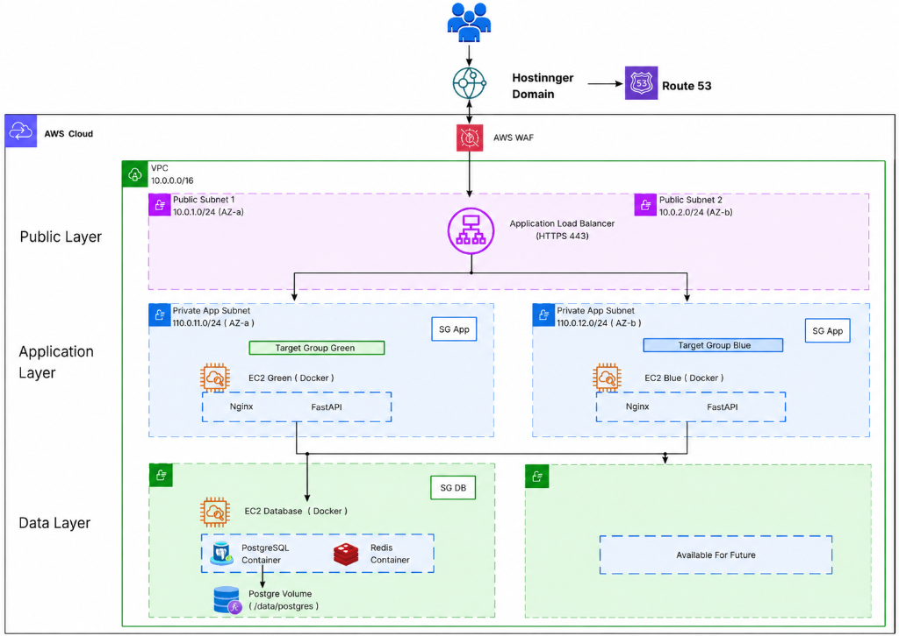

# FastAPI Application Infrastructure Setup on AWS

This repository contains the Terraform configurations to deploy a secure, highly available, and scalable AWS infrastructure for hosting a Dockerized FastAPI application with a PostgreSQL and Redis backend. 

The setup implements a modern blue-green deployment strategy behind an Application Load Balancer (ALB), with Route 53 DNS routing and HTTPS encryption handled by ACM certificates.

---

## Architecture Diagram

Below is the visual representation of the AWS Cloud infrastructure deployed by this Terraform configuration:



---

## Architectural Component Breakdown

The infrastructure is logically segmented into three secure layers within a custom VPC (`10.0.0.0/16`):

### 1. Public Layer
*   **VPC Subnets**: Two Public Subnets (`10.0.1.0/24` in `ap-south-1a` and `10.0.2.0/24` in `ap-south-1b`) for high availability.
*   **Application Load Balancer (ALB)**: Listens on HTTP (80) and redirects to HTTPS (443) using an SSL certificate validated via ACM. It routes traffic dynamically to the active (Blue/Green) target groups.
*   **Gateways**: Internet Gateway (IGW) for public routing and a NAT Gateway inside the public subnet to allow private instances outbound-only internet traffic.

### 2. Application Layer
*   **Private App Subnets**: Two private subnets (`10.0.11.0/24` in `ap-south-1a` and `10.0.12.0/24` in `ap-south-1b`) hosting the application servers.
*   **Application Servers**: Dual EC2 instances (`green` and `blue`) running Dockerized Nginx reverse-proxies forwarding to FastAPI application containers.
*   **Target Groups**: Separate Target Groups for Blue and Green deployments, enabling seamless traffic switching.

### 3. Data Layer
*   **Private DB Subnets**: Isolated subnets (`10.0.21.0/24` in `ap-south-1a` and `10.0.22.0/24` in `ap-south-1b`) for data persistence.
*   **Database Server**: An EC2 Database instance running PostgreSQL and Redis containers with persistent Docker volumes (`/data/postgres`) for data persistence.

### 4. Security & DNS
*   **Security Groups**: Fine-grained access control:
    *   `alb-sg`: Allows inbound traffic on HTTP/HTTPS from anywhere.
    *   `app-sg`: Allows HTTP/HTTPS only from the ALB, and SSH only from the Bastion host.
    *   `db-sg`: Allows PostgreSQL (5432) and Redis (6379) only from the app instances, and SSH only from the Bastion host.
    *   `bastion-sg`: Allows SSH access for administrative debugging.
*   **DNS & Domains**: Route 53 Zone mapped to the Hostinger domain (`prakashghorpade.shop`) with A records pointing subdomain aliases (`blue`, `green`, `www`) to the ALB.

---

## Terraform Code Structure

Below is the directory map of the Terraform configuration files:

| Component / Resource | Terraform File | Description |
| :--- | :--- | :--- |
| **VPC, NAT Gateway & Subnets** | [main.tf](file:///c:/Prakash/Practice/FastAPI-application-Infrastructure-setup-using-Terraform/main.tf) | Standard networking setup including VPC, internet gateway, EIP, NAT, route tables, and subnet associations. |
| **Subnet & Instance Configuration** | [locals.tf](file:///c:/Prakash/Practice/FastAPI-application-Infrastructure-setup-using-Terraform/locals.tf) | Configures subnet CIDRs, AZs, VM specs (bastion, green, blue, database), SGs, and target group ports. |
| **Input Variables** | [variables.tf](file:///c:/Prakash/Practice/FastAPI-application-Infrastructure-setup-using-Terraform/variables.tf) | Defines variables like VPC CIDR, target region (`ap-south-1`), and environment (`prod`). |
| **Provider Configuration** | [provider.tf](file:///c:/Prakash/Practice/FastAPI-application-Infrastructure-setup-using-Terraform/provider.tf) | Configures the AWS provider and defaults. |
| **Required Settings** | [terraform.tf](file:///c:/Prakash/Practice/FastAPI-application-Infrastructure-setup-using-Terraform/terraform.tf) | Defines the required Terraform and provider versions. |
| **EC2 Server Instances** | [instances.tf](file:///c:/Prakash/Practice/FastAPI-application-Infrastructure-setup-using-Terraform/instances.tf) | Provisions the EC2 servers (Bastion, Blue, Green, and Database) with gp3 storage. |
| **Load Balancer (ALB)** | [alb.tf](file:///c:/Prakash/Practice/FastAPI-application-Infrastructure-setup-using-Terraform/alb.tf) | Provisions ALB, Target Groups (Blue/Green/Production), Listeners, and Routing Rules. |
| **Route 53 DNS Records** | [route53.tf](file:///c:/Prakash/Practice/FastAPI-application-Infrastructure-setup-using-Terraform/route53.tf) | Manages hosted zone and A records for subdomains. |
| **SSL ACM Certificates** | [acm.tf](file:///c:/Prakash/Practice/FastAPI-application-Infrastructure-setup-using-Terraform/acm.tf) | Provisions SSL certificate with automated DNS verification. |
| **Security Groups** | [securitygroup.tf](file:///c:/Prakash/Practice/FastAPI-application-Infrastructure-setup-using-Terraform/securitygroup.tf) | Sets up inbound and outbound security rules for each layer. |
| **AWS WAF (Web Application Firewall)** | [waf.tf](file:///c:/Prakash/Practice/FastAPI-application-Infrastructure-setup-using-Terraform/waf.tf) | Configures the Web ACL and associates it with the Application Load Balancer. |
| **Outputs** | [output.tf](file:///c:/Prakash/Practice/FastAPI-application-Infrastructure-setup-using-Terraform/output.tf) | Defines output variables such as VPC ID, ALB DNS, and Route 53 name servers. |

---

## Deployment Instructions

### Prerequisites
1.  Install [Terraform CLI](https://developer.hashicorp.com/terraform/downloads).
2.  Install and configure the [AWS CLI](https://aws.amazon.com/cli/) with administrative credentials.

### Steps
1.  **Initialize the workspace**:
    ```bash
    terraform init
    ```
2.  **Verify the deployment plan**:
    ```bash
    terraform plan
    ```
3.  **Deploy the resources on AWS**:
    ```bash
    terraform apply
    ```
4.  **Configure Name Servers**:
    Copy the Route 53 name servers from the Terraform output `route53_name_servers` and update them in your Hostinger domain configuration panel to point your domain to AWS Route 53.
